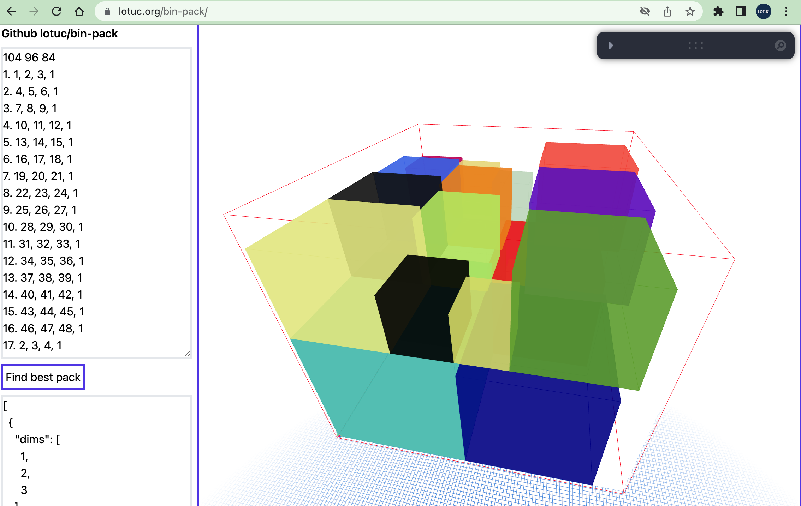

# bin-pack visualizer

The visualizer is mainly built with
[@react-three/fiber](https://github.com/pmndrs/react-three-fiber) and
[@react-three/drei](https://github.com/pmndrs/drei).

You can find a deployed version of this visualizer at
https://lotuc.org/bin-pack/.

